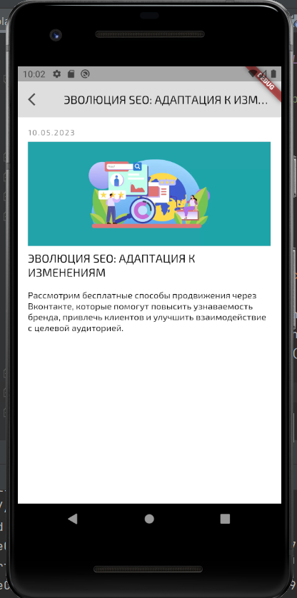

# Newsflutter

1.	Загрузочный экран с анимацией на пару секунд.
2.	Экран авторизации, где можно ввести любой номер телефона и авторизоваться. Если ввести номер телефона 911, то авторизация выдаст ошибку и не пропустит дальше.
3.	Экран списка новостей из 5 новостей с картинкой. 
4.	Экран с подробным описанием новости. Возможность вернуться назад.
5.	Сверху кнопка перехода на экран аккаунта, где отображается введенный номер телефона и есть возможность выйти. Возможность вернуться назад.
6.	В приложении для реализации запросов использован Dio, для сохранения состояний - Shared Preference, для роутинга - router. 

